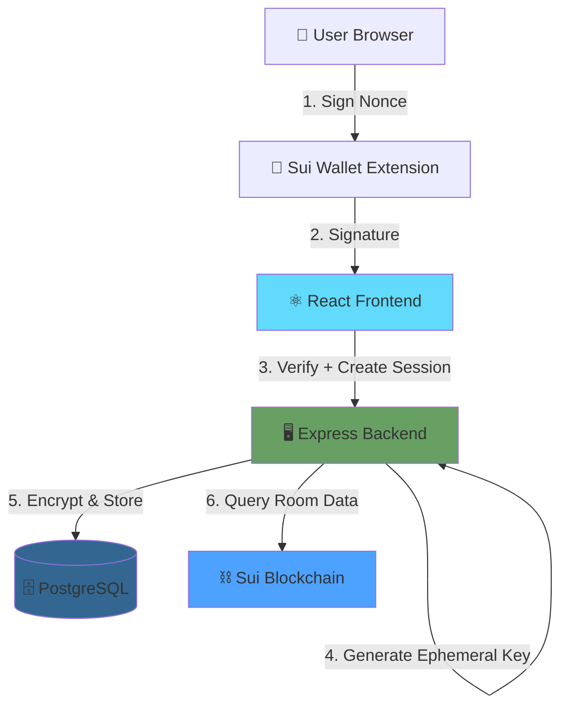
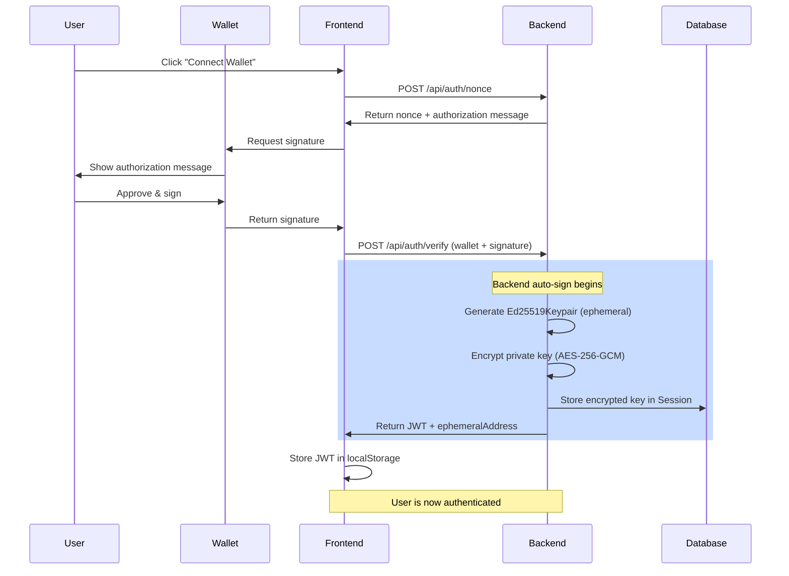
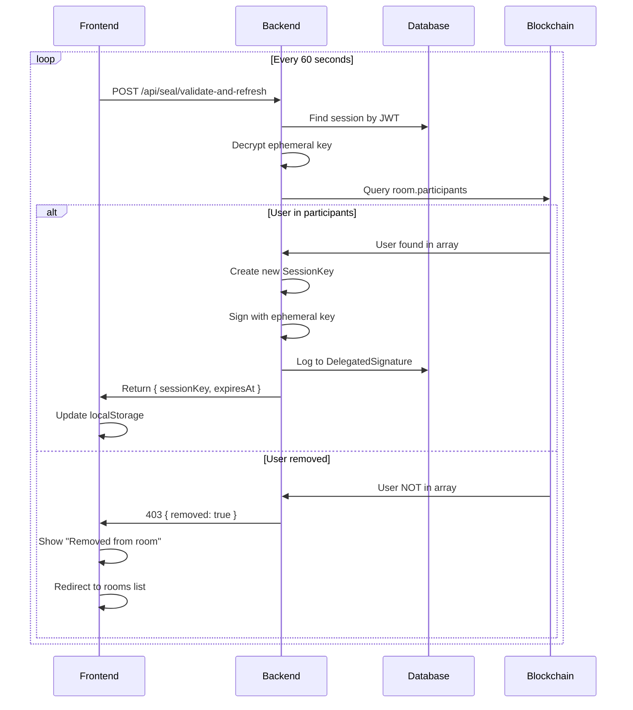
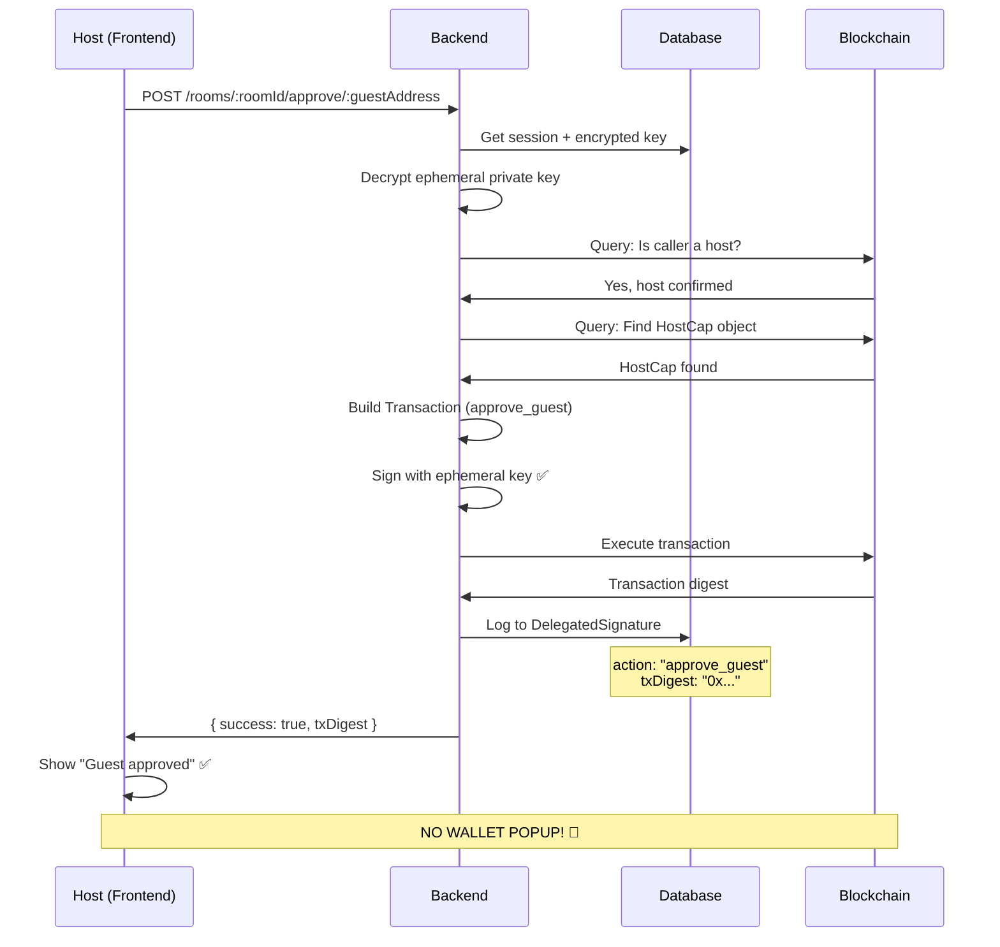
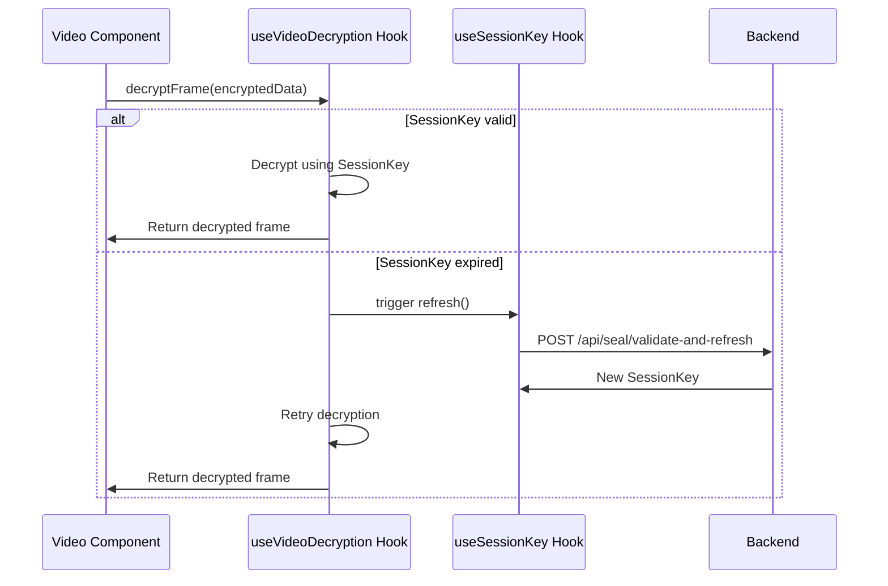

# SuiMeet Architecture: SessionKey Auto-Refresh System

## Overview

SuiMeet uses an innovative **ephemeral key auto-signing** system that provides a seamless user experience without requiring wallet popups for every transaction. This document explains the architecture, security model, and data flows.

## Why Ephemeral Keys?

### Traditional Approach Problems
- **Poor UX**: Users must approve every transaction via wallet popup
- **Interruptions**: Wallet popups break the meeting experience
- **Friction**: Multiple approvals needed for host actions (approve guest, start recording, end room)
- **Mobile Issues**: Wallet popups are especially problematic on mobile devices

### Our Solution: Ephemeral Keys
- **One-Time Authorization**: User signs once during authentication
- **Backend Auto-Signing**: Backend signs transactions on behalf of user
- **Encrypted Storage**: Ephemeral private keys encrypted at rest (AES-256-GCM)
- **Session-Bound**: Keys expire with session (24 hours default)
- **Blockchain Validation**: All operations validated by smart contract

### Security Guarantees
✅ **Blockchain Enforces Permissions**: Smart contract validates all operations
✅ **Encrypted at Rest**: Private keys encrypted with AES-256-GCM
✅ **Audit Trail**: Every action logged in DelegatedSignature table
✅ **Automatic Expiry**: Sessions expire after 24 hours
✅ **Removal Detection**: Users auto-removed if no longer in room participants

---

## System Architecture

### Components



### Data Storage

| Component | What is Stored | Where | Encryption |
|-----------|---------------|-------|------------|
| **Backend Database** | Encrypted ephemeral Ed25519 private key | `Session.encryptedPrivateKey` | AES-256-GCM |
| **Backend Database** | Audit log of all actions | `DelegatedSignature` table | No (public audit) |
| **Frontend localStorage** | SessionKey serialized JSON | `seal_session_{roomId}` | No (SessionKey is public) |
| **User Wallet** | Primary wallet private key | Browser extension | Wallet's encryption |

---

## Data Flow Diagrams

### 1. Authentication & Ephemeral Key Generation



### 2. SessionKey Validation & Refresh



### 3. Host Action (Approve Guest) - No Wallet Popup



### 4. Video Frame Decryption (Future)



---

## Security Model

### Threat Model

| Threat | Mitigation |
|--------|-----------|
| **Database breach** | Private keys encrypted with AES-256-GCM, key stored separately |
| **Unauthorized transactions** | Blockchain validates all operations, only valid HostCap holders can execute |
| **Session hijacking** | JWT with short expiry (1h), refresh token rotation |
| **Key theft** | Ephemeral keys expire with session (24h max) |
| **User stays after removal** | Periodic validation (60s) auto-detects removal |

### Encryption Details

**Algorithm**: AES-256-GCM (Authenticated Encryption)

```typescript
// Encryption (Backend)
const ephemeralKeypair = new Ed25519Keypair();
const privateKeyBytes = ephemeralKeypair.getSecretKey();
const encrypted = encryptPrivateKey(privateKeyBytes); // AES-256-GCM
// Returns: { ciphertext, iv, authTag }

// Decryption (Backend)
const decrypted = decryptPrivateKey(ciphertext, iv, authTag);
const reconstructed = Ed25519Keypair.fromSecretKey(decrypted);
// Can now sign transactions
```

**Key Management**:
- Encryption key stored in `ENCRYPTION_KEY` environment variable
- Must be 64 hex characters (32 bytes / 256 bits)
- Generated with: `openssl rand -hex 32`
- **Never** committed to version control

### Audit Trail

Every action is logged in `DelegatedSignature` table:

```sql
CREATE TABLE "DelegatedSignature" (
  id          TEXT PRIMARY KEY,
  sessionId   TEXT NOT NULL,
  action      VARCHAR(128),  -- "approve_guest", "sessionkey_refresh", etc.
  roomId      VARCHAR(66),   -- Room object ID
  txDigest    VARCHAR(128),  -- Blockchain transaction digest
  signature   VARCHAR(1024), -- The actual signature
  createdAt   TIMESTAMP
);
```

Query audit log:
```sql
-- All actions by a session
SELECT * FROM "DelegatedSignature" WHERE "sessionId" = 'session-id';

-- All actions in a room
SELECT * FROM "DelegatedSignature" WHERE "roomId" = '0x...';

-- All approve_guest actions
SELECT * FROM "DelegatedSignature" WHERE "action" = 'approve_guest';
```

---

## Frontend vs Backend Responsibilities

### Frontend Responsibilities
✅ Connect user wallet (one-time)
✅ Sign nonce for authentication
✅ Store JWT in localStorage
✅ Manage SessionKey lifecycle (load, refresh, clear)
✅ Detect expiry and trigger refresh
✅ Handle removal from room (redirect)
✅ Display UI for host actions

❌ NEVER stores unencrypted private keys
❌ NEVER signs transactions after initial auth

### Backend Responsibilities
✅ Generate and encrypt ephemeral keys
✅ Decrypt keys for transaction signing
✅ Validate user permissions via blockchain queries
✅ Build and sign transactions with ephemeral key
✅ Execute transactions on Sui blockchain
✅ Log all actions to audit trail
✅ Validate SessionKey refresh requests
✅ Detect user removal from room

❌ NEVER leaks unencrypted private keys to frontend
❌ NEVER executes transactions without blockchain validation

---

## Performance Considerations

### SessionKey Refresh Timing
- **Interval**: 60 seconds
- **Initial delay**: 5 seconds after page load
- **Why not more frequent?**: Blockchain queries are expensive
- **Why not less frequent?**: User could stay in room after removal

### Optimization Strategies
1. **Cache blockchain queries**: Cache room participants for 30s
2. **Batch validations**: Validate multiple rooms in single request
3. **WebSocket updates**: Push removal notifications instead of polling
4. **Conditional refresh**: Only refresh if SessionKey expires soon

### Concurrent Refresh Prevention
```typescript
// Hook uses ref to prevent concurrent refreshes
const refreshingRef = useRef(false);

if (refreshingRef.current) {
  return false; // Skip if already refreshing
}

refreshingRef.current = true;
// ... perform refresh
refreshingRef.current = false;
```

---

## Deployment Considerations

### Environment Variables
Required:
- `ENCRYPTION_KEY` - 64 hex characters (32 bytes)
- `JWT_SECRET` - Secret for JWT signing
- `DATABASE_URL` - PostgreSQL connection string
- `SUI_PACKAGE_ID` - Deployed SuiMeet package ID
- `REGISTRY_OBJECT_ID` - Shared registry object ID
- `SUI_NETWORK` - testnet/mainnet

### Database Migrations
```bash
# Generate migration
npx prisma migrate dev --name setup_backend_sessionkey_refresh

# Apply to production
npx prisma migrate deploy
```

### Security Checklist
- [ ] `ENCRYPTION_KEY` set and never committed
- [ ] `JWT_SECRET` rotated regularly
- [ ] HTTPS enabled in production
- [ ] Rate limiting on auth endpoints
- [ ] CORS configured correctly
- [ ] Database encrypted at rest
- [ ] Audit logs monitored

---

## Monitoring & Observability

### Key Metrics
- SessionKey refresh success rate
- SessionKey refresh latency
- User removal detections per hour
- Failed blockchain validations
- Ephemeral key decryption errors

### Logging
```typescript
// Backend logs all actions
console.log('[SessionKey] Refreshed successfully, expires at:', expiresAt);
console.error('[SessionKey] User has been removed from room');
console.warn('[Blockchain] Query failed, retrying...');

// Frontend logs key events
console.log('[Meeting] SessionKey expired, refreshing...');
console.error('[Meeting] Validation check failed:', error);
```

### Alerts
Set up alerts for:
- High SessionKey refresh failure rate (> 10%)
- Blockchain query failures (> 5%)
- Unusual DelegatedSignature patterns
- Session count exceeding limits

---

## Future Enhancements

1. **Video Encryption**: Implement Seal SDK video frame decryption
2. **WebSocket Push**: Real-time removal notifications
3. **Multi-Room Sessions**: Single ephemeral key for multiple rooms
4. **Key Rotation**: Automatic ephemeral key rotation every 12h
5. **Hardware Security**: Support for hardware security modules (HSM)
6. **Zero-Knowledge Proofs**: Prove room membership without revealing identity

---

## References

- [Sui Documentation](https://docs.sui.io/)
- [Seal SDK Documentation](https://github.com/MystenLabs/seal)
- [Ed25519 Specification](https://ed25519.cr.yp.to/)
- [AES-GCM Specification](https://nvlpubs.nist.gov/nistpubs/Legacy/SP/nistspecialpublication800-38d.pdf)
- [JWT Best Practices](https://datatracker.ietf.org/doc/html/rfc8725)
